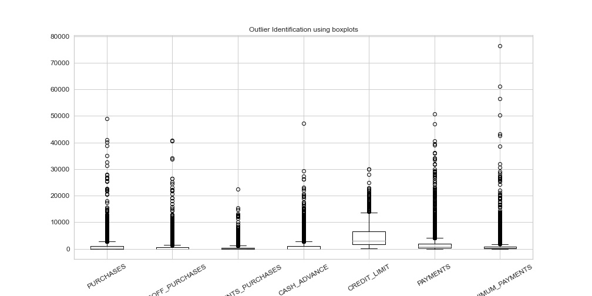
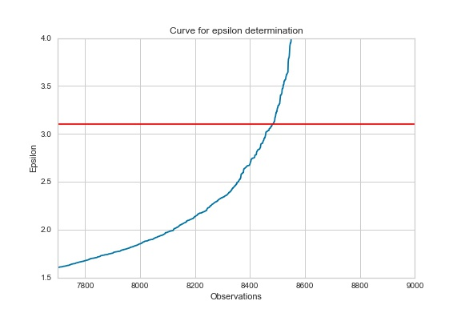
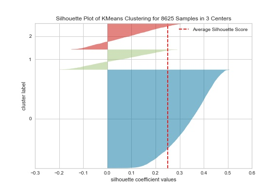
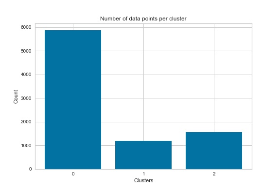

## Background
Making decisions is a critical aspect of any company; one that shapes its course and often determines the success or failure of the company. Today, the whole management world talks about how to create a successful data-driven decision-making process in businesses to improve their results (Valcheva,2018). Data-driven decisions are decisions that rely on analytics, domain knowledge, people, and problem-solving. The vast quantity of data that exists stores an incalculable amount of information with hidden patterns and insights. In the past two years alone, 90% of the world’s data was created (Bulao, 2021). To be successful in the information era, companies must rely on data-driven decisions to answer questions about their operations and management. Targeting advertisements to customers who are likely to be receptible, enticing new customers efficiently, and testing how a new product will be received are all challenges that can be approached using insights gained from data that already exists within the company’s framework.

## Purpose
Data by itself is not enough to make a data-driven decision. Various processes of data collection, preparation, processing, cleaning, analysis, and more must be used to gain useful information. This can be done using data that already exists or by creating new data from data that already exists. This project focused on the latter by segmenting the customer base of a credit card company using a clustering algorithm. Clustering algorithms are used to separate various objects or entities into discrete groups based on shared similar characteristics with others in that same group (BigDataLDN, 2018). These groups are then assigned a label to designate data points as belonging to that group. The labels created by this project can be used in future analyses to provide greater prediction capabilities as well as describe the different accounts that exist within these groups in more detail.

## Data Investigation
The data examined in this project is a sample dataset that contains 8,950 customer accounts for a credit card company that spans information from the last 6 months. There was a total of 18 variables in the dataset, with one of those being a unique customer ID. Ignoring that customer ID, 17 variables were left in the dataset that could be used as features in a clustering algorithm. The variables included a mixture of numerical and binary data types. Exploratory data analysis was performed to gain a better understanding of the data content and structure. Summary statistics of mean, standard deviation, minimum, quartile, median, and max values were all calculated. 
	
It was seen that there were some extreme values that existed within the dataset. As an example, PURCHASES looked at the number of purchases that were made from the account in the 6-month timeframe. The mean value of this variable was 1003 while the median value was 361. This discrepancy shows that outliers exist within the variable, whose range extended from 0 to 49,040. This was further confirmed by examining the kurtosis of the variables in the dataset, with the highest kurtosis value in the dataset being 284. Other variables that showed this type of trend included number of purchases (PURCHASES), maximum purchase amount in a single transaction (ONEOFF_PURCHASES), number of purchases done per installment (INSTALLMENTS_PURCHASES), cash given by user in advance (CASH_ADVANCE), the amount of credit given to the user (CREDIT_LIMIT), total of payments paid by user (PAYMENTS), and smallest amount paid by the user in a transaction (MINIMUM_PAYMENTS). These outliers were visually identified using boxplots for each of the variables previously listed, as shown in Figure 1. Outliers were also detected by the traditional method of using 1.5 times the interquartile range (IQR) of the variables. Since the variables all started at 0, the upper threshold of 1.5 times the interquartile range plus the third quartile (1.5 * IQR + Q3) was used to find outliers. Using this method, 3,404 potential outliers were identified within the samples.

   Figure 1 - Boxplots of outlier likely variables
  
Histograms were also created for all variables, which showed very unbalanced distributions amongst all variables, including heavy left skew, right skew, and bimodal distributions. The 17 variables within this dataset had skew values that ranged from -2.94 to 13.62, illustrating that much of the data was highly unsymmetrical. These unbalanced histograms demonstrated the need to standardize the data within the dataset before using them in any clustering algorithms. 

## Data Cleaning
It was decided that losing over a third of the data by using the traditional means of 1.5 times IQR would not be helpful in determining clusters for future data. Instead, outliers were removed using custom thresholds by examining Figure 1. Thresholds were created to remove points that were far removed from the rest of the data within the variable (such as values over 45,000 for PURCHASES). Once these outliers were removed, 8,625 observations remained in the dataset. Originally, the dataset had 313 missing values that existed within the MINIMUM_PAYMENTS variable. After the removal of possible outliers from the dataset, all these missing data points no longer existed within the dataset. The remaining variables were checked for missing values. There was 1 missing value for the CREDIT_LIMIT variable, which was imputed using the median of the variable. The removal of these outliers had a significant improvement on the skew of the variables, with 15 of the variables showing improvement in their skew values and the remaining 2 showing only minor increases in skew of approximately .05. Kurtosis of the variables likewise improved as well, with the maximum value of kurtosis within the dataset reduced to 116 from 283. 

## Data Preprocessing
The data was further modified before it was separated into individual clusters. The data was first standardized so that the mean was 0 and standard deviation was 1 for all variables. The main benefit of this is to help with distance-based measurements since the variables would have different units of measurements between them otherwise (Dabbura, 2018). After the data was standardized, principal component analysis of all variables was performed. Principal component analysis (PCA) is a dimensionality reduction technique that helps reduce the number of features while retaining the most amount of data possible. The benefit of reducing features can help alleviate problems related to high dimensionality (using many variables) and speed up the time it takes to train the algorithms (Scikit-Learn, 2010). After undergoing PCA, the data was reduced to 16 features, down from 17. 

## Model Development and Performance

For this problem, two clustering algorithms were chosen to cluster the data: k means and DBSCAN. K means was chosen as it is a general-purpose clustering algorithm and DBSCAN was selected since it is resistant to outliers and can identify noise. The metric that was used to determine the relative success of the clustering algorithms was the Silhouette coefficient, which looks at the distance between a sample and other points in its class as well as the distance from all other points in the next nearest cluster. The output for this metric is on a scale of -1 to 1, with values closer to 1 indicating more densely packed clusters and negative values representing incorrect clustering.

	Figure 2 - Epsilon Determination using sorted nearest neighbor differences.

For the construction of the models, hyperparameters were selected based on the instruction of relevant literature. Hyperparameters can be thought of as settings that are selected to tell the algorithms how to process the data that is given to them. For the DBSCAN model, the two hyperparameters that were set were minimum points and Epsilon. The minimum points that belong to each core point is determined by a rule of thumb of twice the number of features used in the clustering algorithm, which was 32 due to the 16 features used for this model. The epsilon is determined by plotting the distance of all nearest neighbor of points in ascending order. This plot generates a curve and at the point of maximum curvature determines the ideal epsilon value (Mullin, 2020). The ideal epsilon point for this model was determined to be 3.1 as shown in Figure 2. For the k means model, the hyperparamter that needed to be chosen was the number of clusters in which the data would be clustered. To determine the ideal number of clusters, a k means model was built for having a number of clusters from 2 – 19. The silhouette score was calculated for each of these models and the 3-cluster model performed the best with a silhouette score of .251.

	Figure 3 - The silhouette scores for the k means model

The silhouette scores for the k means and DBSCAN models were .251 and .580, respectively (the final k mean model was initialized with a different random state from the test model constructed). Initially, the DBSCAN model appeared to outperform the k means model. However, the DBSCAN model only separated the data into two clusters: a cluster of data points and noise points, which effectively meant that no novel clusters were created. The k means model separated the groups into 3 distinct classes, with 1 class representing most of the data and two smaller classes. Looking at Figure 3, while most of the points in the cluster have positive values some do have negative values. Figure 4 shows the distribution of data points within each cluster of the k means model. Cluster 0 contained 5,877 observations, cluster 1 contained 1,194 observations, and cluster 2 contained 1,554 obeservations. 

## Conclusion
While the DBSCAN did receive a better score according to the metric that was used, its inability to effectively create clusters of the data make it ineffective for this task. The k means model, while it does contain some points that have negative silhouette scores, succeeded in separating the dataset into distinct groups that can now be assigned as labels for the data. The labels generated by the k means model will allow for further exploration of the dataset. This includes both examining the similarities that exist between data points within each cluster as well as being able to use the labels that were generated in supervised learning algorithms for future predictive models. 

## References
BigDataLDN. (2018, May 3). Why use clustering in data mining? Big Data LDN. https://bigdataldn.com/intelligence/why-use-clustering-in-data-mining/

Bulao, J. (2020, June 24). How Much Data Is Created Every Day in 2020? [You’ll be shocked!]. TechJury. https://techjury.net/blog/how-much-data-is-created-every-day/

Mullin, T. (2020, July 15). DBSCAN Parameter Estimation Using Python. Medium. https://medium.com/@tarammullin/dbscan-parameter-estimation-ff8330e3a3bd

Scikit-Learn. (2010). 2.3. Clustering — scikit-learn 0.20.3 documentation. Scikit-Learn.org. https://scikit-learn.org/stable/modules/clustering.html#k-means

Valcheva, S. (2018, March 7). Data Driven Decision Making in Business: Process and Model. Blog for Data-Driven Business. http://www.intellspot.com/data-driven-decision-making/

## Data Source and Project Code
[Dataset Collected from Kaggle](https://www.kaggle.com/arjunbhasin2013/ccdata)

[Github with Code and Whitepaper Report](https://github.com/tripleee19/Credit_Card_Clustering)
