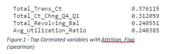
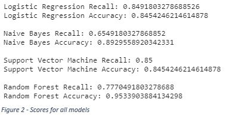

## Abstract
Reducing customer churn is an effective method for reducing the costs incurred for acquiring new customers. A dataset acquired from Analyttica’s LEAPS program contained the records of over 10,000 customers examining many variables related to them, including level of education, marital status, income, and age. These variables were examined to find their relationship to the target variable that was present in the dataset: attrition of the customer. Features were created from the data by examining their attributes, encoding them, and preparing them for their use in various predictive models. The data was split into two groups with one group used to train the models and the second to evaluate their efficacy. The predictive models that were used in this project were Logistic Regression, Naïve Bayes, Support Vector Machine, and Random Forest. Once all models were fit to the training data, incremental improvements were measured using cross validation techniques. Once finalized, model performance was measured using the testing dataset. Recall was prioritized above accuracy and plans for further improvement of the models and metric reports were given.

_Keywords: Logistic Regression, Naïve Bayes, Support Vector Machine, Random Forest, Machine Learning, Classification Model, Predictive Analytics, Churn Prediction, Finance_

## Intro and Background
For every business, there is a cost that is incurred when forming an initial relationship with a customer to buy into the business. This process, called customer acquisition, can generate costs in various ways: staffing salespeople to make initial contact with prospective clients, paying for online marketing campaigns, and other methods of first contact with consumers (Silver, n.d.). For this reason, it is often more profitable for a business to form longer lasting relationships with its customers than constantly bring new customers into the brand. Customer attrition, also referred to as churn, is when an individual leaves the business either to pursue the same service elsewhere or drop the service entirely. 

Churning customers can generate more costs for a business by increasing the need for acquiring new customers. To prevent a customer from churning, it is necessary to contact them to address their needs in more effective manner and incentivize them to continue utilizing the current products and services. This can prove difficult because contact must happen before they churn to be effective. The business must be able to predict whether an individual will decide to leave, which is a choice that is affected by many different factors and hard to guess for this reason. It is imperative to create a tool that can take multiple factors about a customer into account to determine if they will churn to accurately predict who is most likely to leave so that efforts to retain them can be more successful.

## Data Exploration
The target variable that was the Attrition_Flag variable that denoted whether a customer had churned out of the company within the past few months. With the presence of a binary target variable in the dataset, it was determined that this was a supervised learning binary classification problem. The dataset has 10,127 records, of which 1,627 of the customers had churned, which is 16.07% of the total records. 

Initially, it was determined that there were no missing records in the data set, due to the lack of any NA values within the dataset. Upon further inspection, it was found that there were missing values, that were marked by string ‘Unknown’, within the data. These ‘Unknown’ values were found in the variables concerning education level, marital status, and income category of the customers. While deciding what to do with these values, it was theorized that the presence of these variables may be a useful predictor for predicting churn. This was decided because there is a chance that a customer refused to answer this question, thereby making a choice and thus the data would not be missing at random. There were no missing variables in any of the numeric features.

Plots were generated for each of the variables to examine the distribution of the values for numeric variables and the counts for the categorical variables. Customer age was approximately normally distributed, months on book was highly leptokurtic, and most other numeric variables had high positive skew. Looking at the correlation between the Attrition_Flag variable and the other variables, there were five variables that had a correlation that was greater than .2, pictured in Figure 1.

## Data Preparation
The first step to preparing all the variables for modeling was to encode all binary and categorical variables. With the categorical variables, it was decided to use one hot encoding due to the limited number of levels of the variables. After all the encoding, the number of features was 36, which was not of concern due to the number of observations within the dataset and that feature reduction had not taken place yet. 

The correlation of all features between themselves were examined. Feature pairs that exhibited the highest correlation were credit limit with average open to buy, blue card members with silver card members, and total transaction count with total transaction amount, the correlation values being .996, .890, and .807, respectively. This highlighted the possibility that these features were redundant with each other and not all would be needed.

At this point the data was split into training and test sets, with the test set containing 25% of the total records. Due to the concern of leaking the test set into the training set, all exploratory scoring involved in this stage was completed cross validation scoring using 5 folds. The data was scaled using standard scaling with the scikit library. 
The scaler was fit to the training features and then both the training and testing features were transformed using the fitted scaler. 

To reduce the number of features that were used in the modeling process, recursive feature elimination with cross validation was used. A logistic regression model was used as the estimator and the scoring was measured using recall. Scoring was measured both before and after feature elimination. The recall score for the logistic regression model was measured as .824 before feature elimination and .849 after. While only a small improvement, it proved the efficacy of the process.

## Modeling
The models that were created for this problem were Logistic Regression, Naïve Bayes, Support Vector Machine, and Random Forest. For all models created, recall and accuracy were used to score the models using cross validation. At this point in time, a confusion matrix was not generated to score the models. The reason for this was because this was a preliminary submission of the project and not the final version. In the effort of preserving the ‘purity’ of the test set, the generation of a confusion matrix with the prediction of testing data will not take place until the final phase of the project. 

## Results
While both accuracy and recall were scored using all models, the nature of wanting to reach as many people who may churn as possible, recall was deemed the more valuable of the two scores. The scores for all models can be seen in Figure 2.

For prioritizing recall, Support Vector Machine and Logistic Regression models performed the best, with nearly identical scores. The random forest model had the highest accuracy by far, with the Naïve Bayes trailing behind by a few percent.

## Conclusion
Since we considered recall the gold metric, either Support Vector Machine or Logistic Regression models will be used in the deployment of this tool. At this point in the project, no hyperparameter tuning was performed, so the ultimate performance of the models may change in the future with more examination and model tweaking. With three of the four models having recall scores that are above 70%, this dataset has proven that it can be used to predict churn at a high enough level that deployment should be almost guaranteed after minor improvements to the modeling process have been finalized. 

## Acknowledgements
I would like to acknowledge Analyttica for providing the dataset that was used in this project. I would also like to acknowledge the scikit learn library for many of the tools used in this project are constructed from their framework. 

## References
* Analyttica. (n.d.). ATH Leaps. Leaps Analyttica. https://leaps.analyttica.com/sample_cases/11 
* Silver, K. (n.d.). Retaining customers vs. Acquiring customers. Business Class: Trends and Insights | American Express. https://www.americanexpress.com/en-us/business/trends-and-insights/articles/retaining-customers-vs-acquiring-customers/. 
