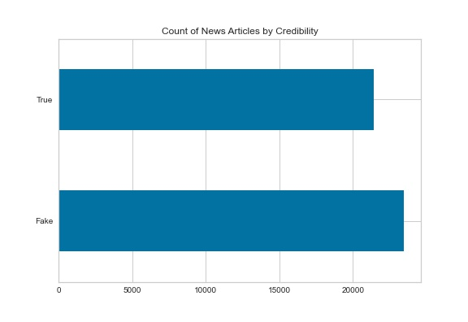
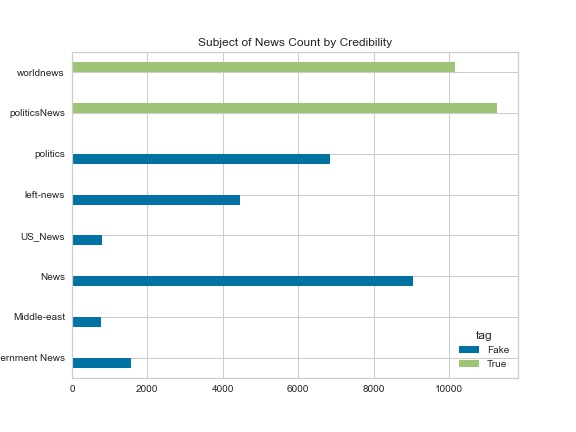
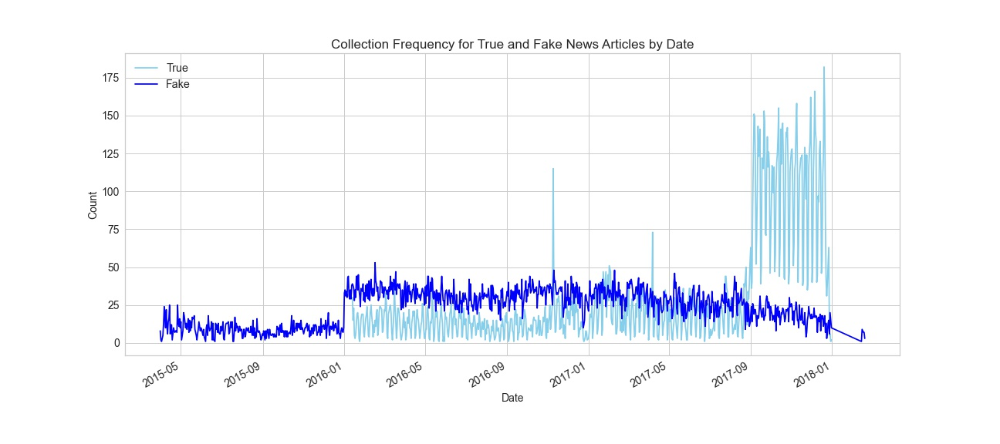

## Purpose
Fake news can be defined as false news stories used to propagate false information or rumors to change peoples behavior (Lorent, 2019). As of 2016, 62% of US citizen get their news from social media (Gottfried & Shearer, 2016). Widespread and malevolent use of fake news stories could have a negative impact within society by unduly influencing citizen in a harmful way. This project was started to determine if a machine learning model could be built to quickly screen online news articles and determine if they are “fake news”. The model would allow people reading the news as they could be warned if the content of the news they’re reading could be intentionally misleading or contain factual errors. 

## Data Investigation
To train the model, I have selected a dataset that contains various online news stories. Each of the stories within this dataset has information about the title, text, subject, date of publication, and tag indicating whether the article was truthful for each story. To start, I performed exploratory data analysis to get a better understanding of the data that was present. There are 44,898 articles present within the dataset containing the following fields: title, text, subject, data of publication, and tag (true or fake). Examining the number of each article type, there are 21,417 “true” articles and 23,481 “fake” articles that are included in the dataset. Given the relatively close proportion, it is unlikely that the models chosen will need to be weighted in favor of a specific class due to imbalance issues. This information was also examined for the subjects of the articles that were present. Examining Figure 2, there is a somewhat even distribution for the subjects of the articles. Upon closer inspection, there is no overlap of subjects for the articles between the true and fake target classes. Due to this I theorized that including the subject while training the model may bias the model by training it to put too much importance into the subject of the article without taking the contents of the text into account.  

   Figure 1 - Proportion of Target Class Values
 Figure 2 - Proportion of Subject Counts by Target Class

## Data Cleaning
While completing the exploratory analysis, some inconsistencies were observed within some of the data. I discovered some columns that were incorrectly filled as the only thing present was the website for the article and nothing else in the title, text, and data columns. There were 9 observations with this error and due to the low number, they were removed without any special precautions. Another error found was the presence of an article title in the date column with no accompanying value in the text column. This observation was removed as the one mentioned above. Lastly, the date that was present for all the articles was converted to a datetime object. This let us the date be worked with more easily so that it may be included into the analysis. The data was then split into training and testing sets so models can be improved and tweaked without undermining the conclusion of the project.
  
True news in the dataset was scraped from Reuters, a news organization that is well known for its low bias and highly factual reporting (MediaBias/FactCheck, n.d.). As a result, many of the true news stories within the dataset have Reuters listed at the very start of the article text. To analyze any possible bias during modeling, a preliminary model was built with Reuters both present and removed. The overall accuracy remained unaffected, but to remain careful, Reuters was kept removed.

## Data Preprocessing
  There are many ways to prepare text data for the purposes of machine learning (Davydova, 2018).  Most of the preprocessing centers around removing the noise from the text so the model is only trained on the meaningful parts. Some the processing steps applied to the data were: the removal of numbers, converting text to lowercase, removal of punctuation, removal of whitespace, tokenization (conversion of each word to its own unit), removal of stop words (words that add no value to sentence meaning), and stemming (conversion of a word to its root). By completing all these steps, the text now contained no filler information and reduces unnecessary computational workload from the model in the future.

## Model Development and Performance
  The preprocessed text data was vectorized using Term Frequency – Inverse Document Frequency (TF-IDF). This turns the text data into numerical data that can help separate more relevant words from less relevant ones based on their occurrence within each article and when compared to all articles (Jayaswal, 2020). Three models were trained and tested on the prepared data: logistic regression, naïve bayes, and random forest. These models were chosen due to their efficiency in predicting the outcome of binary events. All model training and evaluation at this point were done using the training data to preserve the validity of the testing dataset. The models were trained with default parameters to establish a baseline of performance. After training, the accuracy of the models was 93.6%, 98.5%, and 98.6% for naïve bayes, logistic regression, and random forest models, respectively. 
  
Due to the already high values for these models, they were determined to be adequate for solving the problem posed the project and did not undergo any parameter changes. These models were then scored using the testing data for the following results in terms of accuracy: 94.1% for naïve bayes, 98.8% for logistic regression, and 99% for random forest.  

## Conclusion
  The elevated accuracies achieved by the default models are a cause of some concern upon initial inspection. For the model to achieve a score that high, there are a few explanations. One, the problem this project is trying to solve is trivially simplistic. Two, the dataset collected is only representative of a small subset of online articles that are easy to predict and not of online news. Three, the data stored within the dataset is leaking information to the model somehow that is giving it an unfair advantage at solving the problem, creating a model that is ineffective if deployed.
  
The dataset was re-examined and there were no apparent flaws within the approach or methodology of the paper. The models were successful in their ability to detect fake news articles based on the presence of terms unique to their target class. The random forest model is the model of choice for this problem, given the highest score that it was able to achieve. For further improvements to the model, it is suggested that more news sites are selected to pull stories from for both the true and fake news articles. This will help the model to detect fake news against a wider variety of writing styles and improve the instances in which it will be successful.  

## References
Davydova, O. (2018). Text Preprocessing in Python: Steps, Tools, and Examples. Data Monsters.

Gottfried, J., & Shearer, E. (2016). News Use Across Social Medial Platform123s. Pew Research Center.

Jayaswal, V. (2020). Text Vectorization: Term Frequency — Inverse Document Frequency (TFIDF). Towards Data Science.

Lorent, S. (2019). Fake News Detection Using Machine. University of Liege.

MediaBias/FactCheck. (n.d.). Reuters - media bias fact check. Media Bias Fact Check. https://mediabiasfactcheck.com/reuters/.

## Supplementary Image

Visual showing the dates and counts of when articles used in the dataset were published.

## Data Source and Project Code
[Dataset Collected from Kaggle](https://www.kaggle.com/clmentbisaillon/fake-and-real-news-dataset)

[Github with Code and Whitepaper Report](https://github.com/tripleee19/FakeNewsDetection)
