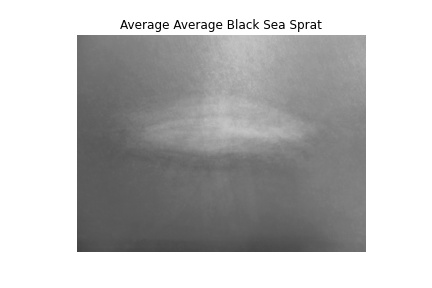
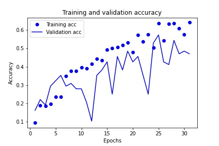
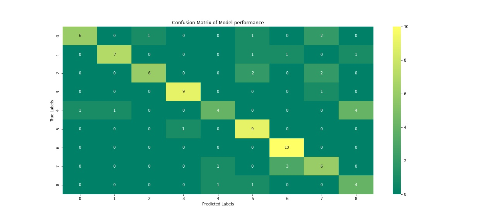

## Background
A picture is worth a thousand words. A lot of information can be absorbed by looking at an image or scene closely and inspecting what is present. It is the reason a person can call themselves a “visual-learner” and why it is often helpful to accompany a data heavy argument with an infographic that conveys the basis of what a person is saying. The human brain can identify an image that’s been seen for as little as 13 milliseconds (Romih, 2016). While humans are gifted at recognizing and naming images, computers do not have the same innate talent. However, with the right tools, a computer can detect patterns within images with greater speed than any person could hope to achieve. This task is referred as image classification: the labeling of images into one of a number of predefined classes (Jain, 2019). Image classification has a great amount of utility in a modern world, such as detecting cancer from an x-ray, facial recognition, and even autonomous driving (Jain, 2019).

## Purpose
This project will develop a model that will be able to view a photo of a fish and determine the type of fish from a predetermined list. This will be accomplished by using a convolutional neural network to analyze imaging data from photos of fish that can then be used to classify the fish. This model will serve as an example of a use case of image classification within a defined space. In the context of a real-world situation, this model could be used to automatically separate fish into their distinct groups by using images taken while the fish are transported along an assembly line. Other aspects of this project will serve as the steps that are necessary to process images into a usable data format, such as amalgamating data into array that can be used to store and manipulate data and augment a small amount of data through the creation of slightly modified images.

## Data Investigation
The data for this project consists of 430 images from 9 types of fish. The list of fish are as follows: black sea sprat, gilt head bream, horse mackerel, red mullet, red sea bream, sea bass, shrimp, striped, red mullet, and trout. There were 50 images for each type of fish, apart from trout which only had 30 images. The resolutions for these images were split between 2832 x 2128 and 1024 x 768, giving the images an aspect ratio of 4:3. All photos were in color.

Figure 1 - Mean image of the black sea sprat

To get a better sense of the pictures, a mean image was created for each type of fish in the data (Patil, 2018). This mean image was calculated from grayscale data from the images, and thus, is not available in color. While the images lacked detail, they provided a general sense of what each image contained. From this data, it was seen that the images themselves were all taken from a similar viewpoint, with the camera viewing the fish from above as it was placed on a mat or other background surface. The fish running somewhat parallel to the wider dimension of the photo in most of the images, however, faint outlines in the mean image showed that sometimes the fish were oriented vertically instead, as seen in Figure 1.

## Data Cleaning and Preprocessing
First, all the photos were imported into Python can converted into numpy arrays for easy manipulation. To address the differing resolutions of the images, as well as the high dimensionality of the images in general, all the images were resized to 590 x 445, which had the benefits of both reducing the dimensionality of the images and maintaining the aspect ratio for all images. The labels for all the images were one hot encoded for use in the algorithms and to prevent the model from assigning higher importance on any one of the labels due to the size of an integer. The image data and labels were then split into training and testing sets to measure the success of the model at the final stage. A learning rate scheduler was created to decrease the learning rate as the neural network training progressed to reduce the chance of overfit. Finally, an ImageDataGenerator object was created to creating additional images to be used in model training by slightly altering existing images to overcome the issues of the dataset containing a small number of images. 

## Model Development and Performance
The model used to classify the images in this project was a neural network. The foundation of this neural network focused on convolutional layers paired with pooling layers and a final fully connected layer that would serve as the final output of the model. The alternating convolutional and pooling layers had the benefit of letting the model look at how a pixel compares to its neighbors, which allowed for useful patterns and features to be detected within the images. Each convolutional layer was also implemented with L2 regularization to reduce possible overfit. After the convolutional and pooling layers, the data was flattened so it could be used in the final layer to make the prediction. Due to the introduction of generated images, a dropout layer was added to the model to reduce the risk of overfit within the model.

Figure 2 - Visual of model performance during training.

Figure 3 - Confusion Matrix of final model results

The model was then run for 31 epochs, due to the loss value not improving after 3 consecutive epochs. The accuracy of the final layer of this model was 64.13%, which is an underwhelming result for the model. The validation accuracy for this same timepoint was 47.06%, which shows that the data was overfit and that the model was limited in what it could do. A plot showing the model training over time can be seen in Figure 2. These scores were all obtained as part of the training of the model. The final result of the model was an accuracy of 70.93%. Figure 3 shows a confusion matrix of the model results and their distribution amongst the target classes. 

## Conclusion
The low accuracy of the model indicates that it was not suited to any real-world application at the time. However, the project did complete its second goal of displaying how a convolutional neural network can be used to approach an image classification problem. The spikes in validation accuracy of the training graph demonstrate an overfit of the model to the training data, despite the steps taken to counter it. Due to this, it is most likely that the overfit is due to the small sample size of the images. A promising solution to this would be to increase the amount of augmented data that is present within the model. This can be done by save dozens of edits made per image to a directory and then importing all the edits along with the original images and then proceeding with the project as already laid out in this paper.

## References
Jain, T. (2019, August 29). Basics of Machine Learning Image Classification Techniques. Retrieved from https://iq.opengenus.org/basics-of-machine-learning-image-classification-techniques/
Patil, P. (2018, May 23). What is Exploratory Data Analysis? Retrieved from https://towardsdatascience.com/exploratory-data-analysis-8fc1cb20fd15
Romih, T. (2016). Humans Are Visual Creatures. Retrieved from https://www.seyens.com/humans-are-visual-creatures/
